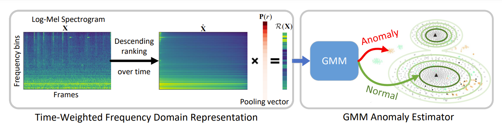

# TWFR-GMM
Time-weighted Frequency Domain Audio Representation with GMM Estimator for  Anomalous Sound Detection (ICASSP2023 Accept)

## Results on DCASE2022 dataset
harmonic mean of AUC-S (AUC with Source domain), AUC-T(AUC with Target domain) and pAUC

`AUC-S(%)/AUC-T(%)/pAUC(%)` in Table
### development dataset
| Method          | ToyCar  | ToyTrain | Bearing |  Fan    | Gearbox | Slider  |  Valve  |  Average  |
| --------------- | :-----: |  :----:  | :----:  | :----:  |:----:   | :----:  | :----:  |   :----:  |
| mean-GMM        |**89.59**/69.05/58.93        |85.62/31.89/52.72        |56.90/**84.69**/54.21    |79.70/**63.16**/62.13    |83.16/76.13/65.42            |90.66/67.77/66.44        |53.61/51.16/50.53            |77.04/63.41/58.63|
| max-GMM         |    79.45/40.81/51.15        |86.36/**48.31**/55.27    |63.64/62.09/51.96        |75.05/49.98/52.19        |73.73/69.62/57.34            |92.36/70.19/70.46        |94.85/89.00/69.92            |80.78/61.43/58.33|
| TWFR-GMM        |**89.59**/69.05/58.93        |88.59/46.16/58.39        |56.90/**84.69**/54.21    |79.70/**63.16**/62.13    |82.93/78.28/63.60            |**95.59**/80.32/73.32    |**95.99**/**90.40**/**72.43**|84.19/73.15/63.29|
| SMOTE-TWFR-GMM  |    88.99/**80.26**/**60.41**|**89.88**/46.50/**59.88**|**64.15**/75.57/**57.12**|**83.11**/61.01/**63.57**|**84.91**/**81.41**/**66.62**|95.09/**84.29**/**76.43**|95.64/89.49/70.15            |**85.97**/**74.08**/**64.89**|
### evaluation dataset
| Method          | ToyCar  | ToyTrain | Bearing |  Fan    | Gearbox | Slider  |  Valve  |  Average  |
| --------------- | :-----: |  :----:  | :----:  | :----:  |:----:   | :----:  | :----:  |   :----:  |
| mean-GMM        |**95.28**/82.83/79.11    |59.41/48.48/51.43        |71.01/**71.74**/57.97    |**58.88**/**42.25**/**51.73**|89.96/80.36/64.11            |76.98/58.07/56.28        |51.42/53.35/51.47        |71.85/62.44/58.87|
| max-GMM         |76.57/54.51/57.56        |60.32/49.86/51.64        |72.33/46.78/51.57        |58.26/32.33/49.55            |72.50/64.05/50.20            |78.21/**70.31**/59.41    |**88.92**/75.91/**66.68**|72.44/56.25/55.23|
| TWFR-GMM        |**95.28**/82.83/79.11    |**69.05**/**55.16**/52.96|**74.65**/68.91/**58.99**|**58.88**/**42.25**/**51.73**|84.28/73.78/58.99            |**85.15**/65.89/**60.34**|88.28/**77.57**/64.17    |**79.37**/66.63/60.90|
| SMOTE-TWFR-GMM  |93.95/**94.01**/**85.63**|67.37/55.13/**53.35**    |72.30/53.10/52.27        |57.18/41.88/51.06            |**90.02**/**84.78**/**65.57**|82.51/66.18/60.15        |87.14/75.82/63.68        |78.64/**67.27**/**61.67**|

## Ablation Study
In addition to the result of weighted mean of Mean-GMM and Max-GMM, we also show the another ablation result of feature fusion by concatenating mean pooling and max pooling representation with GMM for ASD. 
+ **Concate(Mean,Max)-GMM**: Concatenating mean pooling representation and max pooling representation as input feature with GMM for ASD
+ **Weight(Mean,Max)-GMM**: Weighted mean of mean pooling and max pooling representation as input feature with GMM for ASD (the selection of this weight for each machine type is the same as $r$ in TWFR-GMM)

`AUC(%)((AUC-S+AUC-T)/2)/pAUC(%)` in Table
### Results on development set

| Method             | ToyCar  | ToyTrain |  Fan    | Gearbox | Bearing | Slider  |  Valve  |  Average  |
| -----------------------------| :-----: |  :----:  | :----:  | :----:  |:----:   | :----:  | :----:  |   :----:  |
| Concate(Mean,max)-GMM        |78.66/**58.92**|61.79/53.50        |71.09/60.87        |78.61/61.23        |67.66/53.42    |80.97/65.89        |80.36/57.29|74.17/58.73|
| Weight(Mean,Max)-GMM         |79.42/58.75    |67.34/55.28        |71.42/**62.13**    |**80.46**/**65.86**|**70.80**/54.22|83.27/68.32        |90.78/**70.83**|77.64/62.20|
| TWFR-GMM                     |**80.65**/58.12|**67.81**/**59.07**|**71.44**/**62.13**|80.23/64.69        |69.41/**54.74**|**87.96**/**73.33**|**92.61**/70.23|**78.59**/**63.19**|

### Results on evaluation set

| Method             | ToyCar  | ToyTrain |  Fan    | Gearbox | Bearing | Slider  |  Valve  |  Average  |
| -----------------------------| :-----: |  :----:  | :----:  | :----:  |:----:   | :----:  | :----:  |   :----:  |
| Concate(Mean,max)-GMM        |88.93/76.86        |53.63/51.87        |48.52/**51.79**|**80.80**/57.21|68.80/55.45        |75.69/62.45|71.41/56.25|69.68/58.84|
| Weight(Mean,Max)-GMM         |65.56/57.56        |54.95/51.50        |45.22/49.57    |68.65/49.58    |59.55/51.57        |**79.63**/**64.59**|79.90/**65.01**|64.78/55.63|
| TWFR-GMM                     |**89.05**/**79.11**|**62.10**/**52.96**|**50.56**/51.73|79.03/**58.99**|**71.78**/**58.99**|75.52/60.34|**82.92**/64.17|**72.99**/**60.90**|

## Todo
+ select weight of gwrp and components of gmm only using normal data